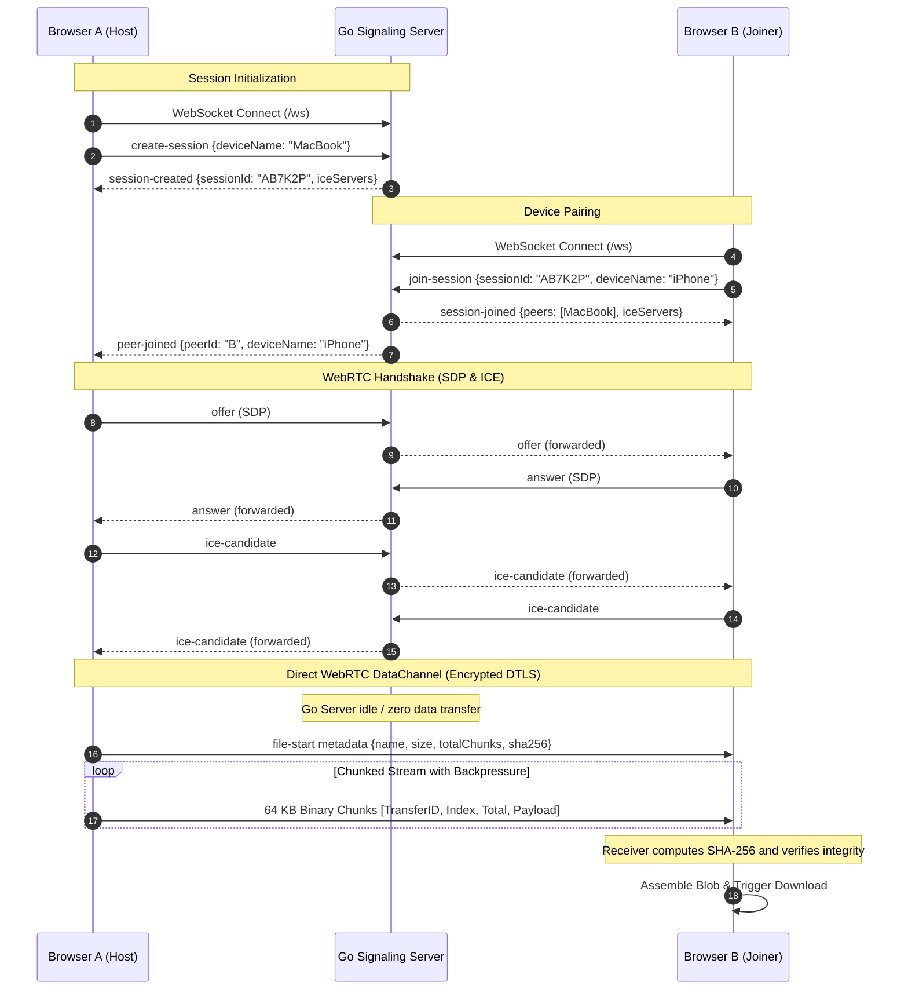

# SlingShare

> **Fast, private, peer-to-peer file and text sharing between devices without accounts or cloud storage.**


---

## Table of Contents

1. [What is SlingShare?](#what-is-slingshare)
2. [Why SlingShare Exists](#why-slingshare-exists)
3. [Architecture Overview](#architecture-overview)
4. [How WebRTC Works in SlingShare](#how-webrtc-works-in-slingshare)
5. [Signaling Architecture](#signaling-architecture)
6. [File Transfer Engine](#file-transfer-engine)
   - [Chunking Protocol](#chunking-protocol)
   - [Backpressure Management](#backpressure-management)
   - [Cryptographic Verification](#cryptographic-verification)
   - [Resumable Transfers](#resumable-transfers)
7. [Security Model](#security-model)
8. [Privacy Model](#privacy-model)
9. [Local Development](#local-development)
10. [Production Deployment](#production-deployment)
11. [STUN / TURN Configuration](#stun--turn-configuration)
12. [Testing](#testing)
13. [Known Browser Limitations](#known-browser-limitations)

---

## What is SlingShare?

**SlingShare** is a browser-based, privacy-first peer-to-peer file, text, and clipboard sharing application. It allows users to send files of any size directly between nearby phones, laptops, and PCs in seconds without requiring user accounts, software installation, or uploading data to centralized cloud storage.

### Product Principle

> *"Open it. Connect your device. Drop something. Done."*

- **Zero Accounts**: No sign-up, email, passwords, or authentication tokens.
- **Zero Cloud Storage**: Payloads never touch server disks, S3 buckets, or databases.
- **True P2P**: High-speed local transfers over Wi-Fi/LAN via WebRTC DataChannels.
- **End-to-End Encrypted**: Transports are protected with DTLS-SRTP.
- **Cross-Platform**: Operates identically on iOS Safari, Android Chrome, Windows Edge, macOS, and Linux.

---

## Why SlingShare Exists

Traditional file sharing between devices sitting in the same room is broken:
- **Cloud Drives (Google Drive, Dropbox, iCloud)**: Force you to upload multi-gigabyte files over slow upstream internet, wait for synchronization, download on the second device, and remember to delete the files later to preserve quota.
- **Ecosystem Walled Gardens (Apple AirDrop, Google Quick Share)**: Do not cross operating system boundaries (e.g. iPhone to Windows, or Android to Mac).
- **Cables & USB**: Require driver installs, MTP software, or physical adapters.
- **Chat / Email Self-Messaging**: Leaves passwords, tokens, and files permanently logged in chat history and sent folders.

SlingShare solves this by utilizing the universal web browser to establish temporary direct sockets between devices.

---

## Architecture Overview



---

## How WebRTC Works in SlingShare

WebRTC enables direct browser-to-browser data transfer using the `RTCDataChannel` interface backed by the Stream Control Transmission Protocol (SCTP) running over Datagram Transport Layer Security (DTLS).

1. **Signaling**: The Go server acts exclusively as an introduction broker to exchange connection parameters (SDP offers/answers and ICE candidates).
2. **Interactive Connectivity Establishment (ICE)**: Browsers query STUN servers to detect their public/private IP bindings.
3. **Direct P2P**: When devices are on the same Wi-Fi router or compatible NATs, traffic flows directly across the local area network at maximum hardware speed (often 50–150 MB/s).
4. **Relayed Fallback**: When devices are behind strict symmetric NATs (e.g. enterprise firewalls or cellular networks), WebRTC falls back to an encrypted TURN relay server.

---

## Signaling Architecture

The backend is built in **Go** using `gorilla/websocket`:

- **Path**: `cmd/server/main.go` and `internal/signaling/server.go`
- **State Management**: `internal/session/manager.go` maintains in-memory ephemeral sessions guarded by `sync.RWMutex`.
- **Security Safeguard**: The WebSocket connection enforces a strict **64 KB maximum message size limit** (`conn.SetReadLimit(65536)`). It is physically impossible to route binary file payloads through the signaling server.
- **Heartbeat & Cleanup**: WebSocket connections utilize ping/pong heartbeats. When a browser closes, the server cleans up the session and notifies the remaining peer with `peer-left`. Empty sessions are automatically evicted.
- **Zero Content Logging**: The backend logs session lifecycle events (session created, peer joined, peer left), but **never logs file names, text snippets, or user data**.

---

## File Transfer Engine

### Chunking Protocol
Browsers cannot transmit large files in a single `dataChannel.send()` invocation without crashing the channel. SlingShare divides files into uniform **64 KB (65,536 bytes)** slices.

Each chunk is framed with a 24-byte binary header:
```
+--------------------------+-----------------------+-----------------------+--------------------+
| Transfer ID (16 bytes)   | Chunk Index (4 bytes) | Total Chunks (4 bytes)| Chunk Payload Data |
+--------------------------+-----------------------+-----------------------+--------------------+
0                          16                      20                      24                  ...
```
This enables zero-overhead serialization and unambiguous reconstruction.

### Backpressure Management
To prevent memory leaks and UI thread freezes when sending multi-gigabyte files, SlingShare monitors the native `dataChannel.bufferedAmount`:
- **High Watermark (1 MB)**: The send loop pauses asynchronously if buffer utilization exceeds 1 MB.
- **Low Watermark (256 KB)**: The loop resumes as soon as the browser flushes pending packets and fires the `bufferedamountlow` event.

### Cryptographic Verification
Before transfer, the sender computes a **SHA-256 digest** using the native W3C Web Crypto API (`crypto.subtle.digest`). When the receiver reassembles all chunks into memory, it calculates the SHA-256 checksum across the bytes. If the checksum does not match, the transfer is aborted with an integrity alert.

### Resumable Transfers
Each chunk carries an explicit 4-byte `chunkIndex`. If the connection momentarily drops and reconnects within the active session, the receiver issues a `file-resume-request` with its last valid chunk index, and the sender resumes from that offset.

---

## Security Model

1. **End-to-End Encryption**: Data channels use DTLS with AES-GCM or ChaCha20-Poly1305 ciphers. The signaling server cannot inspect transfer content.
2. **Ephemeral Identifiers**: Room codes (e.g., `AB7K2P`) are generated using cryptographically secure random bytes (`crypto/rand`) omitting ambiguous characters (0, O, 1, I).
3. **Session Expiration**: Inactive or vacant rooms are purged from server memory automatically.
4. **No Arbitrary Filesystem Access**: The browser client relies on the standard W3C File API and Object URLs (`URL.createObjectURL`). Files cannot execute or write outside the user's Downloads folder.

---

## Privacy Model

- **Zero Server Storage**: Files never touch the server disk, memory, or third-party buckets.
- **No Analytics / No Tracking**: No Google Analytics, no tracking cookies, no fingerprinting scripts.
- **Explicit Clipboard Interaction**: The application never reads your clipboard without an explicit button click. Received snippets must be explicitly copied.

---

## Local Development

### Prerequisites
- **Go** >= 1.22
- **Node.js** >= 20.0

### Quick Start
Clone the repository and run:
```bash
# Build frontend and start server in one command
make dev
```
Or run individual commands:
```bash
# 1. Build Astro static frontend
cd web && npm install && npm run build && cd ..

# 2. Build and start Go server
go build -o ./bin/server ./cmd/server
./bin/server
```
Visit **`http://localhost:8080`** in your browser.

---

## Production Deployment

### 1. Build Single Executable
```bash
make build
```
The output `./bin/server` contains the Go HTTP and WebSocket signaling server, which automatically serves the pre-built Astro assets from `./web/dist`.

### 2. Run as Systemd Service or Docker Container
```bash
PORT=8080 ./bin/server
```

### 3. Environment Variables

| Variable | Description | Default |
|---|---|---|
| `PORT` | HTTP & WebSocket listen port | `8080` |
| `STUN_SERVERS` | Comma-separated list of STUN servers | `stun:stun.l.google.com:19302,stun:stun1.l.google.com:19302` |
| `TURN_SERVER` | Optional TURN relay URL | *(empty)* |
| `TURN_USERNAME` | TURN authentication username | *(empty)* |
| `TURN_CREDENTIAL` | TURN authentication password | *(empty)* |
| `SITE_URL` | Canonical URL for SEO & sitemap | `https://slingshare.io` |

---

## STUN / TURN Configuration

For deployment across strict corporate firewalls, configure **Coturn**:
```bash
# Install Coturn
sudo apt-get install coturn

# Configure /etc/turnserver.conf
listening-port=3478
realm=yourdomain.com
user=slingshare:SuperSecretPassword

# Pass credentials to SlingShare server
export TURN_SERVER="turn:yourdomain.com:3478?transport=udp"
export TURN_USERNAME="slingshare"
export TURN_CREDENTIAL="SuperSecretPassword"
./bin/server
```

---

## Testing

### Run Backend Unit Tests
```bash
go test -v ./...
```
*Tests session creation, peer joining, room capacity limits, signaling message routing, and disconnect cleanups.*

### Run End-to-End Tests
```bash
cd web
node e2e-test.mjs
```
*Launches two headless browser contexts in Playwright, creates a session, pairs via room code, establishes a WebRTC DataChannel, exchanges text messages, transfers a chunked binary file with SHA-256 verification, and cleanly handles disconnect.*

---

## Known Browser Limitations

1. **Background Tab Throttling**: Mobile browsers (iOS Safari and Android Chrome) aggressively sleep background tabs. Keep the SlingShare tab visible on mobile during large file transfers.
2. **Localhost SSL Requirements**: Mobile devices pairing with a laptop over LAN require HTTPS or `localhost` to access the Web Crypto API. In production, always serve SlingShare over HTTPS.
3. **Clipboard API Permissions**: Pasting from clipboard requires explicit user action to satisfy browser permission security models.

---

## License

MIT License. Free and open source.